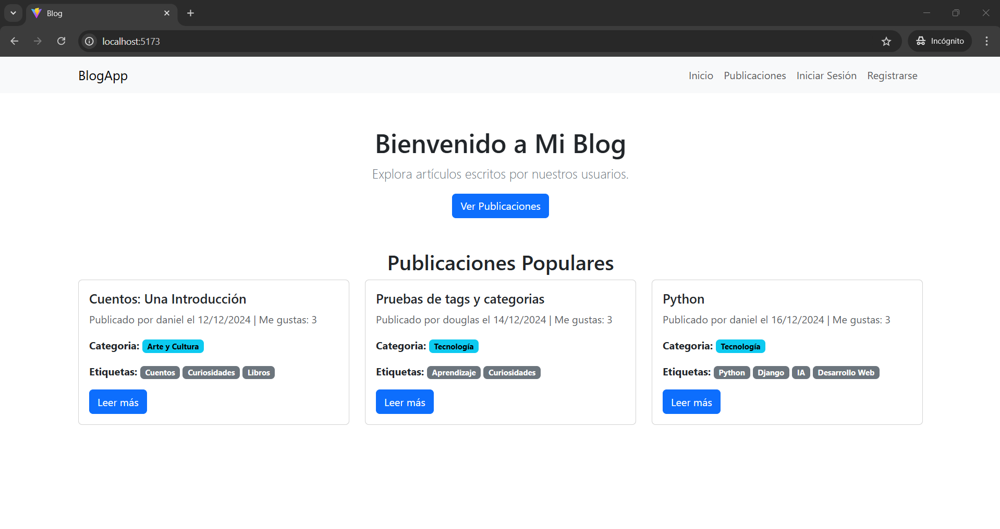
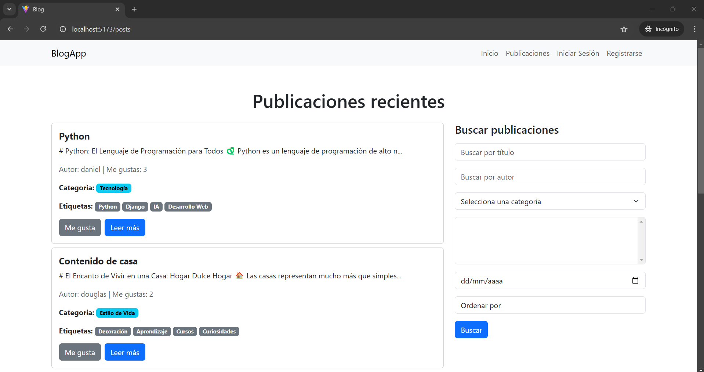
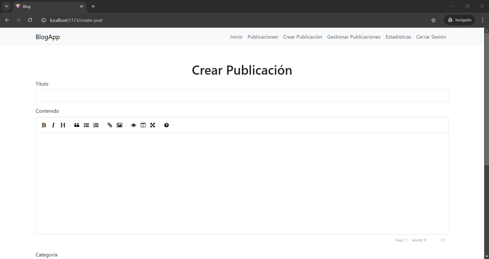
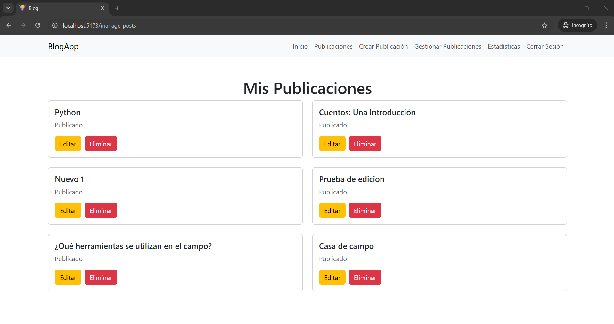
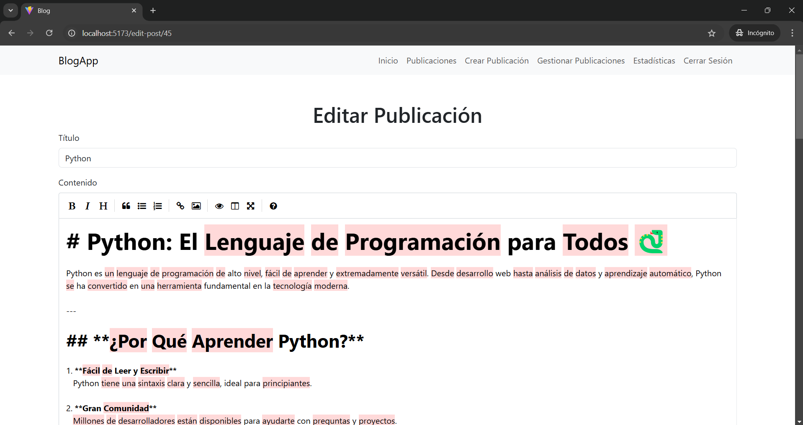
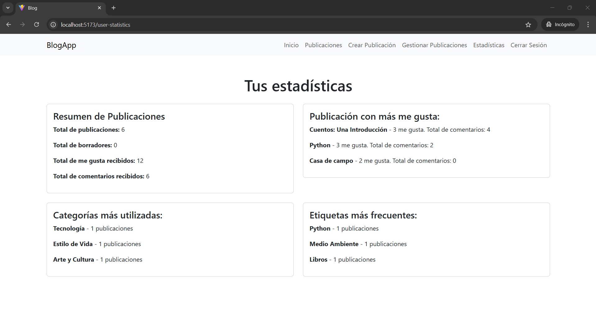

# Blog Platform

Este proyecto es una **aplicación de blog interactiva** desarrollada con **React** usando **Vite** como entorno de desarrollo rápido. Incluye un backend con **Django**, y permite la gestión de publicaciones, comentarios, likes y estadísticas de usuario.

## Características

1. **Sistema de Autenticación**
   - Registro e inicio de sesión para usuarios.
   - Gestión de sesiones.

2. **Gestión de Publicaciones**
   - Crear, editar y eliminar publicaciones.
   - Publicar o guardar publicaciones como borrador.
   - El contenido de las publicaciones se escribe en **Markdown**, con conversión automática a HTML.
   - Buscar publicaciones por título, autor, categoría, etiquetas y fecha.
   - Ordenar por popularidad, recientes o antiguos.

3. **Interactividad**
   - Funcionalidad de likes en las publicaciones.
   - Comentarios en las publicaciones.

4. **Estadísticas del Usuario**
   - Total de publicaciones creadas.
   - Total de borradores creados.
   - Total de comenterios recibidos.
   - Total de likes recibidos.
   - Categorías y etiquetas más utilizadas.
   - Publicaciones con más likes recibidos y comentarios realizados.

5. **Navegación Optimizada**
   - Barra de navegación que permanece fija en la parte superior.
   - Diseño responsivo.

## Tecnologías Utilizadas

### Frontend
- **React** con **Vite**: Generación rápida del proyecto y excelente rendimiento.
- **React Router**: Navegación dinámica entre rutas.
- **CSS / Bootstrap**: Estilización de la interfaz.

### Backend
- **Django**: Framework para el backend con una API REST.
- **JWTAuthentication**: Sistema seguro de autenticación basado en tokens.
- **SQLite**: Base de datos utilizada para almacenar la información.
- **Django ORM**: Para realizar consultas y operaciones con la base de datos.

## Instalación

### Prerrequisitos
- Node.js (v14+ recomendado)
- Python (v3.8+)

### Clonar el repositorio
```bash
https://github.com/tu-usuario/tu-repositorio.git
cd tu-repositorio
```

### Instalación del Frontend
```bash
cd blog_frontend
npm install
```

#### Ejecución del Frontend
```bash
npm run dev
```
Accede al proyecto en `http://localhost:5173`.

### Instalación del Backend
```bash
cd blog_backend
pip install -r requirements.txt
```

#### Migraciones de la base de datos
```bash
python manage.py makemigrations
python manage.py migrate
```

#### Ejecución del Backend
```bash
python manage.py runserver
```

El backend estará disponible en `http://localhost:8000`.

## Uso
1. Crea una cuenta o inicia sesión.
2. Explora las publicaciones disponibles.
3. Crea, edita y elimina tus propias publicaciones.
4. Da likes y comenta en publicaciones.
5. Revisa tus estadísticas de usuario en la página correspondiente.

## Estructura del Proyecto
```bash
├── blog_frontend       # Proyecto React con Vite
│   ├── public          # Archivos estáticos
│   ├── src             # Código fuente React
│   │   ├── api         # Configuración de Axios para consumo de API
│   │   ├── components  # Componentes reutilizables
│   │   ├── pages       # Páginas principales
│   │   ├── App.jsx     # Componente principal
│   │   └── main.jsx    # Punto de entrada
│   └── vite.config.js  # Configuración de Vite
├── blog_backend        # Proyecto Django
│   ├── blog            # App principal de blog
│   ├── manage.py       # Archivo principal para ejecución de Django
│   └── requirements.txt # Dependencias del proyecto
└── README.md           # Documentación
```

## Capturas de Pantalla

- **Inicio**: Es la pagína de inicio, se muestran las tres publicaciones mas populares.
     
- **Lista de Publicaciones:** Muestra las publicaciones con sus categorías y etiquetas.
    
- **Crear publicación**: Para crear una nueva publicación.
    
- **Gestión de publicaciones**: Se muestran las publicaciones creadas por el usuario.
     
- **Editar publicación**: Para editar una publicación.
    
- **Estadísticas del Usuario:** Vista con datos resumidos sobre la actividad del usuario.
    

## Contribución
¡Las contribuciones son bienvenidas! Por favor, abre un issue o envía un pull request.

---
¡Gracias por visitar este proyecto! 😊

